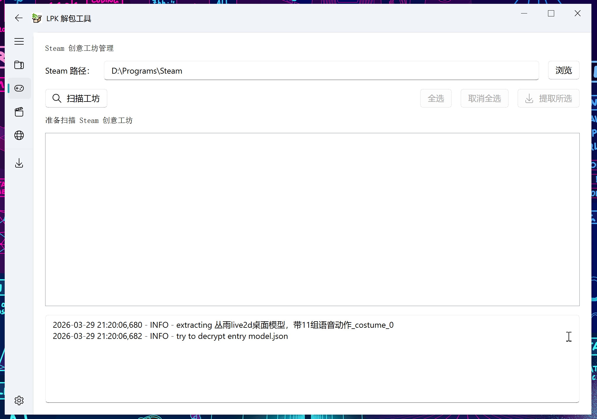
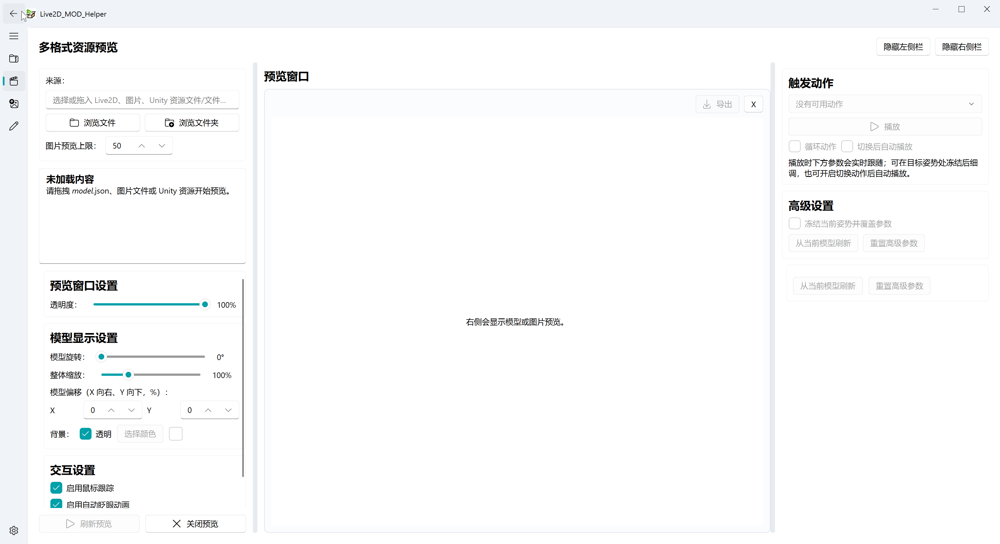
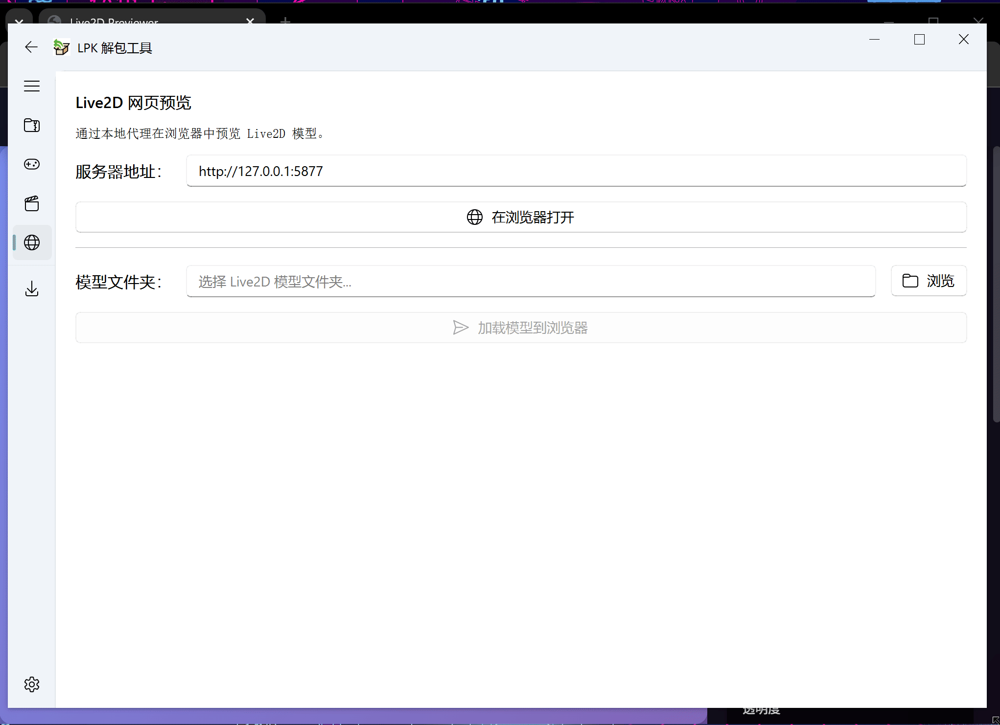

# LpkUnpacker

[English](README_en.md) / 中文

这个工具用来解包Live2dViewerEx的LPK文件

如果你在使用工具时遇到任何困难，请先查询'[Issues](https://github.com/ihopenot/LpkUnpacker/issues)'中的内容

*增加了对STD_1_0以及之前的格式支持
注意，少部分的早期lpk仍然无法解包，推测可能存在未知的密钥生成或解密算法

## 使用说明

### 方法一：使用已编译的EXE文件（推荐）

1. 从[Releases](https://github.com/ihopenot/LpkUnpacker/releases)页面下载最新的LpkUnpackerGUI.exe文件

2. 双击运行LpkUnpackerGUI.exe

3. 在界面中选择要解包的LPK文件、对应的config.json文件（或者拖动也行）以及输出目录(默认输出为exe程序目录下output文件夹)

4. 点击"Extract"按钮开始解包过程,过程可以参考下面的动画演示：


5. Steam创意工坊文件批量处理(只演示查找,因为文件太多不演示批量解包部分):



6. 直接在软件内预览Live2D模型(软件渲染):



7. 直接在软件内预览Live2D模型(网页渲染):



### 方法二：从源码运行

如果你希望从源码运行，请按照以下步骤操作：

1. 安装 pixi 环境
```
pixi install
```

2. 运行程序

如果你需要使用GUI版本，使用如下的命令：

```
pixi run start
```

如果你需要使用命令行解包，可以使用以下命令:
```
pixi run cli <args>
```

命令行参数说明如下所示：

```
usage: cli.py [-h] [-v] [-c CONFIG] target_lpk output_dir

positional arguments:
  target_lpk            path to lpk file
  output_dir            directory to store result

options:
  -h, --help            show this help message and exit
  -v, --verbosity       increase output verbosity
  -c CONFIG, --config CONFIG
                        config.json
```

## 编译

release中的版本使用 Nuitka 编译，并通过 pixi 管理构建环境。如果你希望自行编译可执行文件：

1. 安装 pixi 环境：
   ```
   pixi install
   ```

2. 运行编译：
   ```
   pixi run build
   ```

编译好的可执行文件会保存在 `build` 目录下的 Nuitka standalone 输出目录中。

## 注意

Steam创意工坊中的lpk文件通常需要config.json来解密

.lpk文件通常在下面这样的路径下

`path/to/your/steam/steamapps/workshop/content/616720/...` 或者 `path/to/your/steam/steamapps/common/Live2DViewerEX/shared/workshop/...`

如果要解密wpk文件，你需要先把它解压之后得到lpk文件和config.json文件

## 目前功能

- [√] LPK文件解包GUI界面
- [√] i18n支持（英语和中文）
- [√] 批量解包Steam创意工坊中的LPK文件
- [√] WPK 文件批量扫描与解包
- [√] Unity 图片资源提取（借助 UnityPy）
- [√] 软件内直接预览Live2D文件（支持网页及软件两种渲染方式）
- [√] Live2D 一键魔改工具

## 计划功能（To-Do List）

- [ ] 更完整地还原游戏中的 Live2D 资源结构（借助 UnityPy / AssetStudio CLI）
- [ ] 分图层导出PSD格式文件，方便二次魔改
