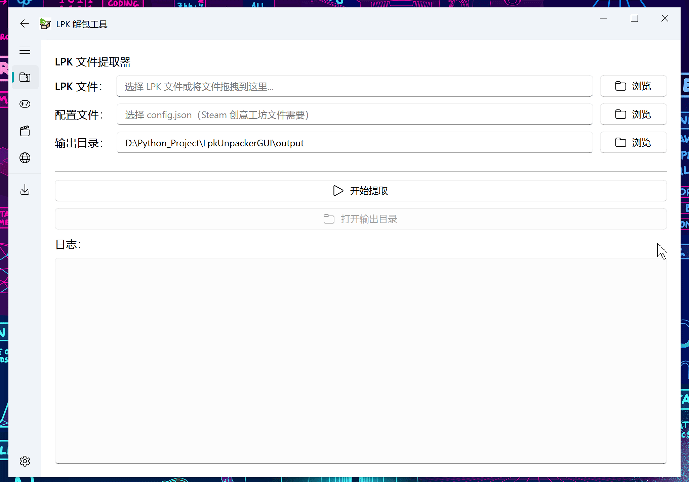

# LpkUnpacker GUI

原仓库[在这](https://github.com/ihopenot/LpkUnpacker),使用python对大部分人来说还是太困难了,因此我做了一个GUI工具,用来解包Live2dViewerEx加密的LPK文件,并将其还原成其他软件/引擎可以识别的正常live2d格式文件

如果你在使用工具时遇到任何困难，请先查询'[Issues](https://github.com/ihopenot/LpkUnpacker/issues)'中的内容

## 新功能特性

- ✨ 支持批量处理 LPK 和 WPK 文件
- 📁 支持文件夹拖放，自动扫描所有 LPK/WPK 文件
- 🖼️ 新增"仅提取图片"模式，快速提取所有图片资源
- 🎨 **Live2D 一键魔改工具** - 轻松为 Live2D 模型添加多套换装
- 🌐 多语言支持（简体中文/英文）
- 🔧 改进的多线程支持，防止界面卡顿
- 📂 智能记忆最后输出目录

## 使用方法

### 方法一：使用已编译的EXE文件（推荐）

1. 从[Releases](https://github.com/Moeary/LpkUnpackerGUI/releases/tag/Gold)页面下载最新的LpkUnpackerGUI.exe文件
2. 双击运行LpkUnpackerGUI.exe
3. 在界面中选择要解包的LPK文件、对应的config.json文件（或者拖动也行）以及输出目录(默认输出为exe程序目录下output文件夹)
4. 点击"Extract"按钮开始解包过程



### 方法二：从源码运行

如果你希望从源码运行，请按照以下步骤操作：

1. 克隆或下载此仓库
2. 安装依赖：
   ```
   pip install -r requirements.txt
   ```
3. 运行主程序：
   ```
   python LpkUnpackerGUI.py
   ```

### Live2D 一键魔改工具

这个工具可以快速为 Live2D 模型添加多套换装（皮肤）功能：

1. **加载模型**
   - 点击"Browse"选择 model.json 文件
   - 或者选择包含模型的文件夹（会自动查找 model*.json）
   - 支持拖放模型文件到界面

2. **配置 HitArea**
   - 输入触摸区域的 ID，例如：`R_weiba_1`、`ArtMesh999`
   - 这个区域将用于触发换装菜单

3. **添加皮肤**
   - 第一行是"原皮"（原始贴图）
   - 点击"Add Skin"添加更多皮肤
   - 为每个皮肤配置：
     - **皮肤名称**：例如"原皮"、"夏日"、"泳装"
     - **贴图文件**：点击"Browse"选择或拖放图片文件
     - **预览**：点击"Preview"预览贴图，再次点击关闭
     - **复制**：点击"Copy from Previous"从上一个皮肤复制贴图

4. **生成魔改文件**
   - 点击"Generate Mod"生成所有文件
   - 程序会：
     - 备份原始 model.json 文件（.backup）
     - 复制贴图文件到模型目录
     - 生成 model0.json、model1.json 等多个模型文件
     - 在 model0.json 中添加换装动作和触摸区域配置

5. **魔改效果**
   - 在 Live2DViewerEX 中，点击配置的触摸区域
   - 会弹出换装菜单，显示所有皮肤名称
   - 选择皮肤即可切换贴图

**示例工作流程**：

```
<userPrompt>
Provide the fully rewritten file, incorporating the suggested code change. You must produce the complete file.
</userPrompt>