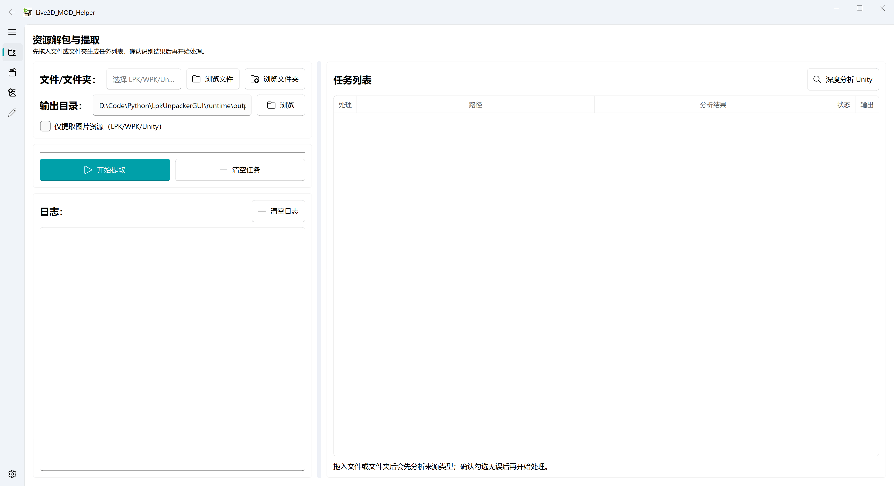
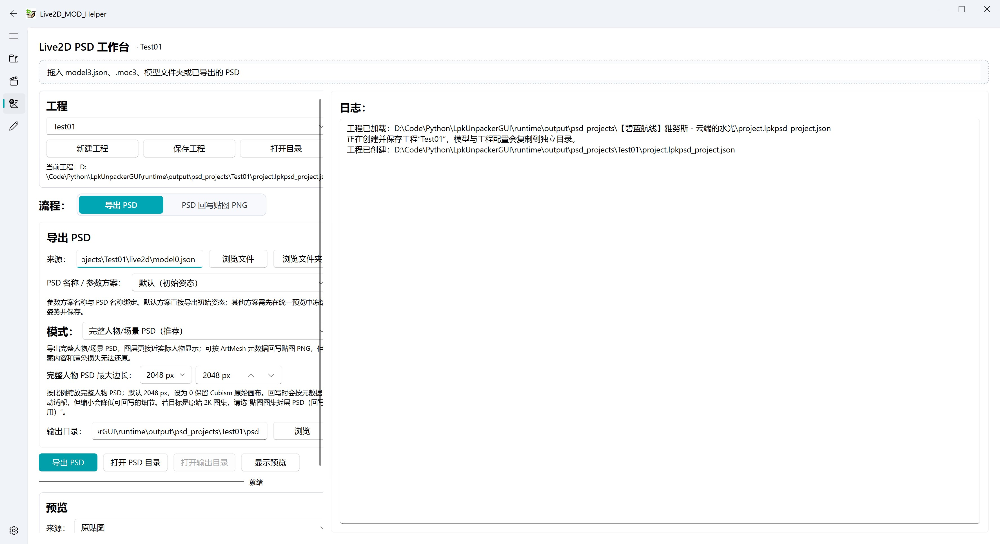
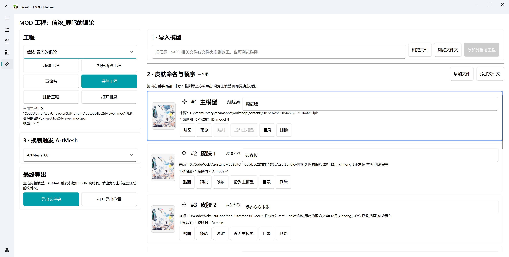

# LpkUnpackerGUI

面向 Live2D 资源处理的桌面工具箱。

它最初用于解包 Live2DViewerEX 的 LPK 文件，如今已经扩展为一套覆盖“资源提取与预览 → PSD 分层编辑与贴图回写 → Live2DViewerEX MOD 制作”的完整工作流。无论来源是 LPK、WPK、Unity 资源、压缩包还是已经解包的模型目录，都可以从同一个程序开始处理。

> 当前主要面向 Windows。少部分早期 LPK 可能使用未知的密钥生成或加密方式，仍然无法解包。

遇到问题时，请先搜索或提交 [Issues](https://github.com/ihopenot/LpkUnpacker/issues)。

## 三大核心模块

| 模块 | 解决的问题 | 主要产物 |
| --- | --- | --- |
| 资源提取与预览 | 从 LPK、WPK、Unity、压缩包及文件夹中发现、提取并查看 Live2D、图片等资源 | 完整解包目录、贴图目录、可预览模型 |
| Live2D PSD 工程 | 把运行时 Live2D 转成可编辑 PSD，并将修改后的图层重新写回贴图 PNG | PSD、`.lpkpsd.json`、回写贴图和版本记录 |
| Live2DViewerEX MOD 工程 | 把主模型和多个贴图版本整理成可点击换装的 MOD | 可继续上传创意工坊的 Live2DViewerEX 文件夹 |

```text
游戏资源 / MOD 包
        │
        ▼
  资源识别、解包与预览
        │
        ├──────────────► PSD 工程 ──► 编辑 PSD ──► 回写贴图
        │
        └──────────────► MOD 工程 ──► 多皮肤与 ArtMesh 换装 ──► 创意工坊目录
```

## 快速开始

### 使用已编译版本

1. 从 [Releases](https://github.com/ihopenot/LpkUnpacker/releases) 下载最新的 `LpkUnpackerGUI.exe`。
2. 运行程序。
3. 根据任务进入“资源解包”“资源预览”“PSD 工作台”或“Live2DViewerEX MOD 工程”。
4. 大部分来源都可以直接拖入对应页面；输出目录可在设置中统一修改。

### 从源码运行

项目使用 [pixi](https://pixi.sh/) 管理 Windows 开发环境。

```powershell
pixi install
pixi run start
```

运行源码检查：

```powershell
pixi run check
```

## 一、资源提取与预览

这一部分负责先把来源中的资源找出来，再决定是完整解包、只提取贴图，还是直接预览。

### 支持的来源

| 来源 | 处理方式 |
| --- | --- |
| `.lpk` | 识别包内容并解包；需要时自动匹配同目录的 `config.json` |
| `.wpk` | 先拆出内部 LPK 和配置，再继续处理其中的 LPK |
| Unity 资源 | 支持 `.assets`、`.sharedassets`、`.bundle`、`.unity3d` 等来源 |
| 文件夹 | 递归扫描其中的 LPK、WPK、Unity 资源和已解包 Live2D 模型 |
| `.zip` / `.7z` / `.rar` | 在统一预览中临时解压，再查找 Live2D 模型和图片 |
| 已解包模型 | 支持 `model3.json`、`.moc3`、模型目录和常见贴图文件 |

LPK 已支持 `STD_1_0` 及更早的常见格式。Steam 创意工坊中的 LPK 通常需要对应的 `config.json` 才能正确解密。

常见位置：

```text
<SteamLibrary>/steamapps/workshop/content/616720/...
<SteamLibrary>/steamapps/common/Live2DViewerEX/shared/workshop/...
```

### 提取能力

- 单个或批量处理 LPK/WPK。
- 递归扫描整个文件夹，不必逐个寻找资源文件。
- 完整解包模型，或只提取图片/贴图。
- 使用随项目提供的 AssetStudioModCLI 识别和导出 Unity 图片、Live2D 候选资源。
- 深度分析 Unity 来源，并区分 Live2D、Spine、混合包或普通资源。
- 批量扫描 Steam 创意工坊内容。
- 自动整理不同来源的输出目录，并记录成功、失败、跳过和导出数量。

LPK 解包演示：



### 统一资源预览

资源预览页可以直接接收模型、图片、Unity 资源、压缩包或文件夹，并自动选择合适的预览方式：

- 在程序内预览 Live2D 模型。
- 使用本地网页预览器查看 Live2D。
- 浏览单张或多张图片。
- 临时提取 Unity 图片进行查看，不污染正式输出目录。
- 从 ZIP/7Z/RAR 中寻找可预览内容。
- 将当前预览资源另行导出。
- 调整 Live2D 参数并保存为 PSD 工程可使用的姿态参数方案。

软件渲染预览：


## 二、Live2D PSD 工程

PSD 工作台用于把运行时 Live2D 资源转换为可编辑图层，并把修改后的 PSD 重新写回模型贴图。

工程配置保存在 `project.lpkpsd_project.json`，模型副本、PSD、元数据、回写版本和预览工作区会集中保存在同一工程目录。

Live2D PSD 预览图:



默认工程位置：

```text
runtime/output/psd_projects/<工程名>/
```

### 建议工作流

1. 拖入 `model3.json`、`.moc3` 或完整模型文件夹并创建 PSD 工程。
2. 选择默认初始姿态，或先在统一预览中调整模型并保存一套参数方案。
3. 根据编辑目标导出 PSD。
4. 在 Photoshop 或其他兼容软件中修改图层。
5. 保留配套的 `.lpkpsd.json` 元数据，通过“PSD 回写”生成新的贴图 PNG。
6. 在程序中预览原始模型和回写版本，确认效果后继续用于 MOD 制作。

### PSD 导出模式

1.  完整人物/场景 PSD

- 优先使用 Cubism Core 读取 ArtMesh 数据。
- 按模型姿态将 ArtMesh 拼成接近实际显示效果的分层 PSD。
- 可以限制最大画布尺寸，兼顾编辑性能和细节。
- 适合查看人物结构、按姿态绘制或制作差分。

2.  贴图图集拆层 PSD

- 按贴图坐标拆分图层。
- 画面不一定像完整人物，但更适合精确修改图集并回写。
- 导出时会生成配套的 `.lpkpsd.json`，回写时依靠它恢复图层位置。

### 贴图回写与版本

- 支持单个 PSD 回写。
- 支持多个 PSD 按优先级叠加回写；列表越靠上优先级越高。
- 自动跳过未修改或重复的像素区域。
- 每次回写都会保留独立版本和 JSON 记录。
- 可在统一预览中加载回写版本，对比原始模型。
- 可配置 Photoshop 路径，从工程页直接打开 PSD。

> PSD 功能仍属于实验性工作流。运行时模型的隐藏内容、混合方式和渲染结果未必能被 PSD 完整还原；若目标是可靠回写原始图集，优先使用“贴图图集拆层 PSD”。

## 三、Live2DViewerEX MOD 工程

MOD 工程用于把同一模型的多个贴图或模型版本整理成皮肤，并在主模型上绑定一个 ArtMesh/HitArea 作为换装入口。工程使用 `project.live2dviewer_mod.json` 保存，不修改原始来源。

Live2DViewerEX MOD 预览图:



默认工程位置：

```text
runtime/output/live2dviewer_mod/<工程名>/
```

### 1. 创建或载入工程

支持两种开始方式：

- 先新建并命名空工程，再导入主模型。
- 没有打开工程时直接拖入 Live2D 来源，由程序解析模型并自动创建工程。

工程搜索框会列出已记录的工程，搜索并选中后立即切换。也可以手动打开磁盘上的 `project.live2dviewer_mod.json`，让已移除记录的工程重新回到列表。

工程支持新建、搜索/读取、重命名、保存、打开目录和删除。删除时默认只移除应用记录并保留磁盘文件，也可以明确选择永久删除整个工程文件夹。

### 2. 导入和管理皮肤

- 可拖入 LPK/WPK、`model3.json`、`.moc3`、Unity 资源、贴图或模型文件夹。
- 空工程第一次导入必须是完整 Live2D 模型，后续可以继续添加完整模型或仅有贴图差异的来源。
- 第一张卡片始终是主模型。
- 每个模型都可以命名为“原皮”“改图 1”等独立皮肤名称。
- 所有卡片都可以自由拖动排序；拖到顶部或点击“设为主模型”即可更换主模型。
- 支持一个模型使用多张贴图，并可以检查或手动调整贴图映射。
- 贴图查看器会显示分辨率、格式、文件大小、SHA-256 摘要，以及完全重复或同尺寸图片提示。
- 可以预览模型、查看贴图、打开来源目录或直接删除某个模型。

### 3. 设置换装 ArtMesh

从主模型中搜索并选择一个尚未绑定其他事件的 ArtMesh/HitArea。导出时程序会：

- 绑定换装菜单和 `change_model` 指令。
- 将该区域提升为最高点击优先级。
- 允许不可见 ArtMesh 接收点击。
- 避免把一个区域同时绑定到原有动作和换装事件。

如果主模型没有声明 HitAreas，程序会继续尝试读取模型中的 ArtMesh ID。更换主模型后，需要重新确认所选区域在新主模型中仍然存在且未被占用。

### 4. 导出创意工坊文件夹

选择“导出文件夹”后，程序会生成 Live2DViewerEX 可读取的模型切换结构、贴图和 JSON 映射表：

```text
MyMod/
├─ model0.json
├─ model1.json
├─ model2.json
├─ 1_0.png
├─ 1_1.png
├─ 2_0.png
├─ skin_manifest.json
└─ texture_mapping.json
```

`model0.json` 是主模型，其他 `modelN.json` 对应皮肤顺序。输出是普通文件夹而不是 ZIP，可以继续补充创意工坊所需内容后上传。

## 输出目录

默认情况下，程序会按资源类型写入 `runtime/output`：

```text
runtime/output/
├─ live2d/             # 解包得到的 Live2D
├─ spine/              # 解包得到的 Spine 资源
├─ unity/              # Unity 资源导出
├─ textures/           # 单独提取的图片/贴图
├─ psd/                # 独立 PSD 导出
├─ psd_projects/       # PSD 工程
└─ live2dviewer_mod/   # Live2DViewerEX MOD 工程
```

输出根目录可以在设置页修改。工程配置、映射、清单和版本信息尽量使用可读的 JSON 保存，便于备份、迁移和后续继续编辑。

## 命令行解包

GUI 之外仍保留基础 LPK 命令行入口：

```powershell
pixi run cli <target_lpk> <output_dir> [-c <config.json>] [-v]
```

```text
usage: cli.py [-h] [-v] [-c CONFIG] target_lpk output_dir

positional arguments:
  target_lpk            path to lpk file
  output_dir            directory to store result

options:
  -h, --help            show this help message and exit
  -v, --verbosity       increase output verbosity
  -c CONFIG, --config CONFIG
                        config.json
```

## 编译

Release 版本使用 Nuitka 编译。

```powershell
pixi install
pixi run build
```

低内存 MinGW/GCC 构建：

```powershell
pixi run build-gcc
```

编译结果保存在 `build` 目录下的 Nuitka standalone 输出目录中。

## 外部工具与依赖

- **AssetStudioModCLI**：随项目提供，用于 Unity 图片提取和 Live2D 资源识别。
- **Live2D Cubism Core**：用于完整人物/场景 PSD 的 ArtMesh 数据读取；程序会自动查找随包 DLL，也可在设置中指定。
- **7-Zip / Bandizip / WinRAR / UnRAR**：用于预览 ZIP、7Z、RAR；可自动从 PATH 查找或在设置中指定。
- **Photoshop（可选）**：用于从 PSD 工程页直接打开文件，不影响 PSD 的生成和回写。

本项目使用 PySide6、PySide6-Fluent-Widgets、Pillow、OpenCV、psd-tools、live2d-py 等组件。

AssetStudio/AssetStudioModCLI 作为外部命令行工具随包提供，采用 MIT License，详见 `app/tools/AssetStudioCLI/LICENSE.txt`。本项目与 Unity Technologies、Live2D Inc. 或 Live2DViewerEX 官方无从属、授权或赞助关系。

## 当前状态与计划

- [x] LPK/WPK 单个与批量解包
- [x] 文件夹递归扫描与 Steam 创意工坊批量处理
- [x] Unity 图片及 Live2D 候选资源提取
- [x] ZIP/7Z/RAR、Live2D、图片和 Unity 资源统一预览
- [x] 软件渲染与网页 Live2D 预览
- [x] Live2D PSD 工程、参数姿态、PSD 导出与贴图回写
- [x] 多 PSD 优先级合成和回写版本预览
- [x] Live2DViewerEX 多皮肤 MOD 工程
- [x] ArtMesh 换装触发、多贴图映射及创意工坊目录导出
- [ ] 更完整地还原游戏中的 Live2D/Spine 资源结构
- [ ] 提升复杂 ArtMesh、隐藏内容和特殊混合模式的 PSD 还原精度
