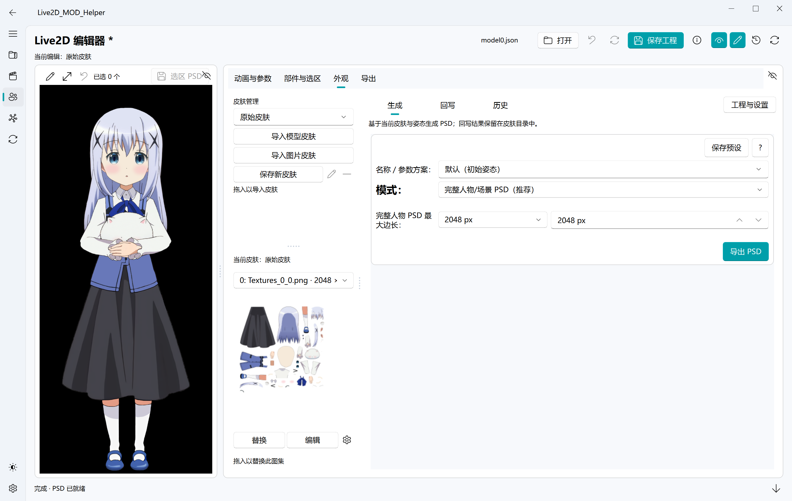

# LpkUnpackerGUI

面向 **Live2D、Spine 与图片资源**的 Windows 桌面工具：解包、预览、轻编辑、PSD 改图与贴图回写。

[下载 Releases](https://github.com/Moeary/LpkUnpackerGUI/releases) · [问题反馈](https://github.com/Moeary/LpkUnpackerGUI/issues) · [编辑器指南](assets/docs/editor-workflow.md) · [PSD 改图指南](assets/docs/psd.md)

## 能做什么

| 功能 | 用途 |
| --- | --- |
| 资源提取 | LPK / WPK、Unity、文件夹、Steam 创意工坊；完整解包或仅提取图片 |
| 统一预览 | Live2D / Spine 原生 Qt/OpenGL 预览；图片与 ZIP / 7Z / RAR 浏览 |
| Live2D 编辑 | 参数、动作关键帧、皮肤、ArtMesh 多选、PSD 导出与回写 |
| Spine 编辑 | 骨骼姿态、动画、slot / attachment、图集部件；版本转换 |
| 工程导出 | 完整模型、可继续编辑的工程副本、ViewerEX 点击换装包 |
| 动画 MCP | 本地 HTTP / stdio，供 AI 读取模型并编辑已有绑定的动画 |



## 开始使用

1. 下载并运行 Release，或从源码启动。
2. 把资源拖入“资源预览”；识别模型后打开对应编辑器。
3. Live2D 改图进入“外观”，局部改图先在“部件与选区”多选 ArtMesh。
4. 用“导出”生成可使用的模型；用顶部“保存工程”另存完整工程，以根 `model.json` 重开。

编辑器在独立工作副本上修改。默认输出目录为 `runtime/output`，可在设置中调整。

## PSD 改图：两种模式

| 模式 | 看到什么 | 适合什么 |
| --- | --- | --- |
| **人物姿态 `mesh`** | 类似渲染画面的人物 / 场景，按 ArtMesh 分层 | 直观绘制；也可只导出几个部件并保持相对位置 |
| **图集拆层 `atlas-components`** | 原始图集像素组成的分层 UV 图 | 精确改贴图；多选 ArtMesh 后可紧凑重排，再映射回原图集 |

导出后点 **“编辑 PSD”**，使用已配置的 Photoshop 或系统默认应用打开。保存后回到“回写”生成新皮肤，用 **“改前 / 改后对比”** 查看图集差异、透明度变化和涉及的 ArtMesh；编辑器内还可查看同一姿态的 PSD 合成参考。直接编辑工作图集 PNG 时，外部保存会自动重载。

请保留 PSD 旁的 `.lpkpsd.json` 与 `.baseline/`。选区 PSD 不要改变画布或图层位置；紧凑重排由导出器完成，不改变模型 UV。旧 `atlas-artmesh` 文件仍可回写，新导出界面不再提供第三种模式。

详细步骤与限制见 [PSD 改图指南](assets/docs/psd.md)。

## 从源码运行

使用 [pixi](https://pixi.sh/) 管理 Windows 环境：

```powershell
pixi install
pixi run start
```

```powershell
pixi run check                               # Python 语法检查
pixi run python -m unittest discover -s tests # 测试（部分需要原生依赖）
pixi run cli <target_lpk> <output_dir> [-c <config.json>]
pixi run build                               # Nuitka + 原生组件构建
```

低内存 GCC 构建使用 `pixi run build-gcc`。工具路径及按需下载位于设置页；Spine 可在提取后生成独立的 3.8.75 转换副本。

## 更多说明

- [编辑器与工程保存](assets/docs/editor-workflow.md)
- [PSD 模式、选区导出、回写与对比](assets/docs/psd.md)
- [ViewerEX 点击换装](assets/docs/viewerex-workflow.md)
- [Spine 部件改图](assets/docs/spine-part-editing.md) · [版本转换](assets/docs/spine-converter.md)
- [动画 MCP 配置](assets/docs/animation-mcp.md)
- [原生组件构建](assets/docs/native-build.md) · [发布流程](assets/docs/RELEASES.md) · [工具下载](assets/docs/toolchain-downloads.md)

## 边界与依赖

- 本工具编辑已有运行时资源，不恢复原作者的 `.cmo3` 或原始 PSD，也不能生成原模型缺少的形变绑定。
- 人物姿态 PSD 会受到遮挡、采样和混合方式影响；图集拆层更适合逐像素修改。Spine 跨版本转换也可能改变动画效果。
- 部分早期 LPK 格式仍不支持；Steam 工坊 LPK 通常需要对应的 `config.json`。
- 使用 PySide6、PySide6-Fluent-Widgets、live2d-py、Pillow、OpenCV、psd-tools 等组件。Cubism Core、Spine 运行时与转换器说明见构建文档和各自第三方声明。
- AssetStudioModCLI 用于 Unity 提取，采用 MIT License；安装来源与声明见 [工具说明](assets/docs/toolchain-downloads.md)。本项目与 Unity Technologies、Live2D Inc. 或 Live2DViewerEX 官方无从属、授权或赞助关系。

README 描述当前源码，已发布版本以对应 Release 说明为准。
