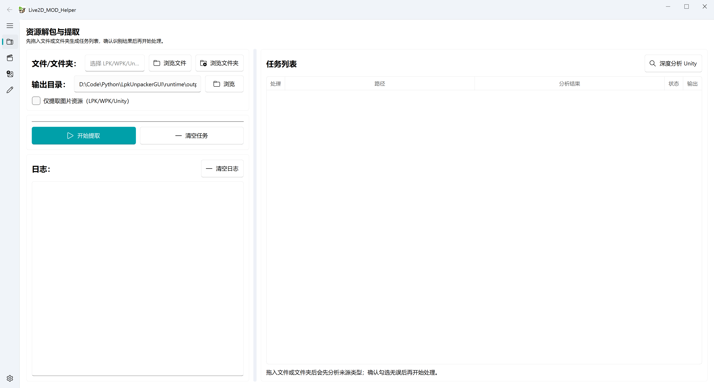
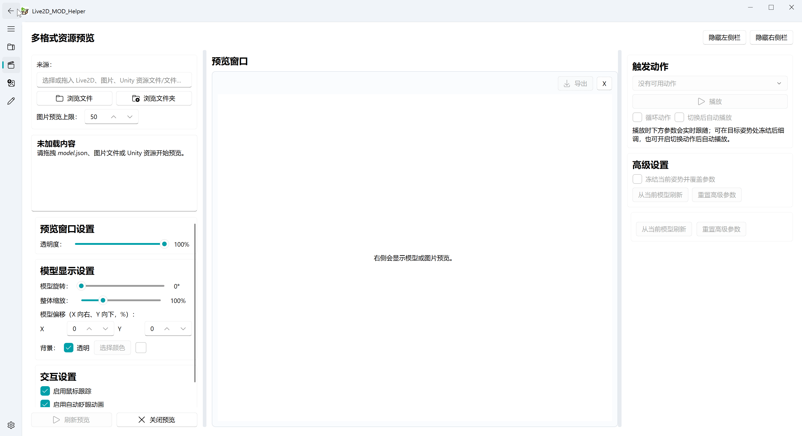
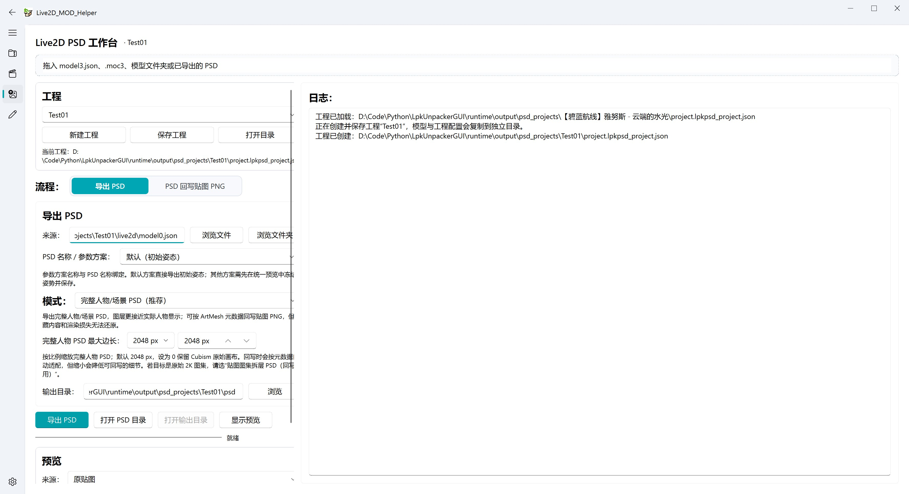
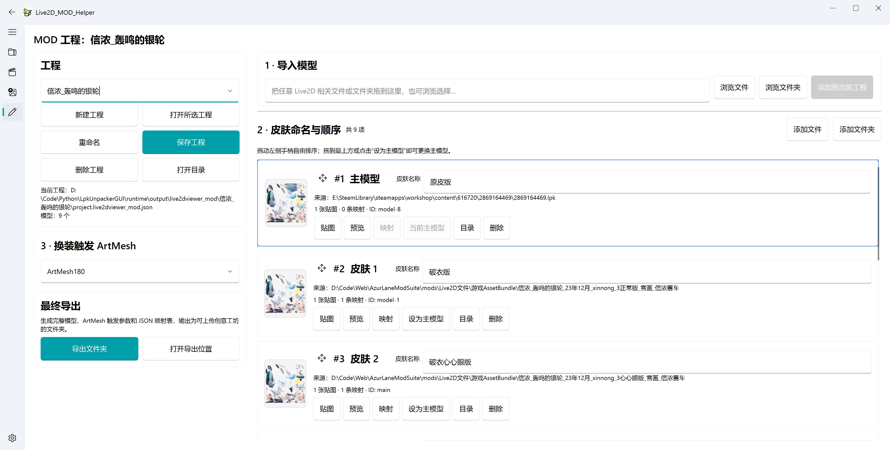

# LpkUnpackerGUI

面向 Live2D、Spine 与图片资源处理的桌面工具箱。

它最初用于解包 Live2DViewerEX 的 LPK 文件，如今支持资源提取与预览、Live2D / Spine 轻编辑、PSD 分层编辑与贴图回写，以及 Live2DViewerEX MOD 制作。无论来源是 LPK、WPK、Unity 资源、压缩包还是已经解包的模型目录，都可以从同一个程序开始处理。

> 当前主要面向 Windows。少部分早期 LPK 可能使用未知的密钥生成或加密方式，仍然无法解包。

遇到问题时，请先搜索或提交 [Issues](https://github.com/ihopenot/LpkUnpacker/issues)。

## 主要模块

| 模块 | 解决的问题 | 主要产物 |
| --- | --- | --- |
| 资源提取与预览 | 从 LPK、WPK、Unity、压缩包及文件夹中发现、提取并查看 Live2D、Spine 和图片 | 完整解包目录、贴图目录、可预览模型 |
| Live2D 编辑器 | 调整参数、动作与贴图；内含完整 PSD 工作台和 MOD 工程管理 | 以 `model.json` 为入口的模型、PSD、MOD 完整工程副本 |
| Spine 编辑器 | 编辑骨骼姿态、动作、slot / attachment、图层顺序与图集部件 | 骨骼 JSON、atlas、贴图及编辑记录的独立副本 |
| Live2D PSD 工作台（编辑器内） | 把运行时 Live2D 转成可编辑 PSD，并将修改后的图层写回当前模型或 MOD 皮肤 | PSD、元数据与 baseline、回写贴图和版本记录 |

```text
游戏资源 / MOD 包
        │
        ▼
  资源识别、解包与预览
        │
        ├──────────────► Live2D 编辑器 ──► 动作 / 贴图 / PSD 工作台 ──► MOD 管理
        │
        └──────────────► Spine 编辑器 ──► 骨骼 / 动画 / 图集副本
```

## 快速开始

### 使用已编译版本

1. 从 [Releases](https://github.com/ihopenot/LpkUnpacker/releases) 下载最新的 `LpkUnpackerGUI.exe`。
2. 运行程序。
3. 先在“资源预览”打开来源；发现有效 Live2D / Spine 模型后，点击“打开 Live2D 编辑器”或“打开 Spine 编辑器”。也可直接从主侧栏进入编辑器或资源解包；完整 PSD 工作台位于 Live2D 编辑器右侧标签。
4. 大部分来源都可以直接拖入对应页面；输出目录可在设置中统一修改。
5. 设置左侧按“通用 / Live2D 工具 / Spine 工具 / 资源与工具下载 / AI / MCP / 其他”分类，右侧滚动显示配置。字体、语言与输出路径在“通用”；明暗主题按钮位于主侧栏“工具设置”正上方，切换后自动保存。

### 从源码运行

项目使用 [pixi](https://pixi.sh/) 管理 Windows 开发环境。

```powershell
pixi install
pixi run start
```

运行源码检查：

```powershell
pixi run check
```

### AI 动画编辑（MCP）

设置页“AI / MCP”可选本地 Streamable HTTP 或 stdio。HTTP 仅监听 `127.0.0.1`，端口默认 `8765` 并可修改；在应用内启动/停止服务，复制地址或客户端配置。stdio 由 MCP 客户端按配置启动。CLI 默认 stdio，也可启用 HTTP：

```powershell
pixi run mcp-animation --workspace "D:\AnimationWorkspace"
pixi run mcp-animation --workspace "D:\AnimationWorkspace" --transport streamable-http --port 8765
```

可读取 Live2D 参数范围或 Spine 骨骼结构，新建动作、修改关键帧，再将模型与动作另存为工作目录内的独立副本。Live2D 使用 `.motion3.json`，Spine 使用骨骼 JSON 动画；原模型不被覆盖。新动作只能使用模型已有的绑定，缺少腿部参数的 Live2D 模型不能凭空生成屈膝形变。

“查看 / 复制 / 另存指南”会生成包含实际连接、输出目录与完整工具 schema 的 Markdown，AI 也可读取 MCP resource `lpk-animation://guide`。输入模型可在其他目录；保存仅限输出工作目录内的新副本，不覆盖原模型。连接示例、工具调用顺序和限制见 [动画 MCP 使用说明](assets/docs/animation-mcp.md)；仓库 [AI 指南](assets/docs/animation-ai-guide.md) 是模板，应用生成的是本机实际配置。

## 一、资源提取与预览

这一部分负责先把来源中的资源找出来，再决定是完整解包、只提取贴图，还是直接预览。

### 支持的来源

| 来源 | 处理方式 |
| --- | --- |
| `.lpk` | 识别包内容并解包；需要时自动匹配同目录的 `config.json` |
| `.wpk` | 先拆出内部 LPK 和配置，再继续处理其中的 LPK |
| Unity 资源 | 支持 `.assets`、`.sharedassets`、`.bundle`、`.unity3d` 等来源 |
| Spine 骨骼与图集 | 预览 JSON / SKEL / `model0.json`；进入 Spine 编辑器后可编辑已有骨骼、动画和图集部件 |
| 文件夹 | 递归扫描其中的 LPK、WPK、Unity 资源和已解包 Live2D 模型 |
| `.zip` / `.7z` / `.rar` | 在统一预览中临时解压，再查找 Live2D、Spine 模型和图片 |
| 已解包模型 | 支持 `model3.json`、`.moc3`、模型目录和常见贴图文件 |

LPK 已支持 `STD_1_0` 及更早的常见格式。Steam 创意工坊中的 LPK 通常需要对应的 `config.json` 才能正确解密。

常见位置：

```text
<SteamLibrary>/steamapps/workshop/content/616720/...
<SteamLibrary>/steamapps/common/Live2DViewerEX/shared/workshop/...
```

### 提取能力

- 单个或批量处理 LPK/WPK。
- 递归扫描整个文件夹，不必逐个寻找资源文件。
- 完整解包模型，或只提取图片/贴图。
- 使用随项目提供的 AssetStudioModCLI 识别和导出 Unity 图片、Live2D 候选资源。
- 深度分析 Unity 来源，并区分 Live2D、Spine、混合包或普通资源。
- 批量扫描 Steam 创意工坊内容。
- 自动整理不同来源的输出目录，并记录成功、失败、跳过和导出数量。

LPK 解包演示：



### 统一资源预览

资源预览页可以直接接收模型、图片、Unity 资源、压缩包或文件夹，并自动选择合适的预览方式：

- 在程序内预览 Live2D 模型。
- 使用原生 Qt/OpenGL 查看 Live2D 和 Spine，无需浏览器或本地 HTTP 服务。
- 浏览单张或多张图片。
- 临时提取 Unity 图片进行查看，不污染正式输出目录。
- 从 ZIP/7Z/RAR 中寻找可预览内容。
- 将当前预览资源另行导出。
- 发现有效模型后打开对应编辑器；图片预览不显示编辑器按钮。

默认启用的“Spine 兼容模式”统一使用 `3.8.75`：预览把其他版本转换到缓存副本，正式提取也使用兼容版本，并在官方 CLI 可用时独立生成 `.spine` 编辑工程。可在“Spine 工具”关闭兼容模式，使用与来源匹配的已验证原生运行时。跨版本转换可能改变动画、约束或曲线效果，界面会显示源版本到 `3.8.75` 的提示；从预览进入编辑器时使用当前实际预览的模型与依赖资源。

### 从预览进入编辑器

统一预览保留模型播放与资源导出，右侧工具随资源格式变化。Live2D 可冻结时间并调整参数与所属 Part 的预览状态；这些调整用于查看当前模型，动作关键帧与可保存的工程编辑位于编辑器。图片使用中央大图和右侧竖向列表，便于连续浏览。切换页面会暂停隐藏页播放。

- **Live2D 编辑器**：参数列表实时驱动模型，动作时间线支持关键帧与线性、阶梯、反向阶梯、贝塞尔曲线；工作贴图由外部编辑器保存后自动重载。右侧“PSD 工作台”保留三种导出、姿态预设、回写、版本和检查器；“MOD 管理”保留完整工程、皮肤与换装导出。“将当前编辑用于 MOD”导入当前模型、动作和贴图的独立快照。
- **Spine 编辑器**：骨骼树、图层与图集选择联动原生预览，可编辑设置姿态、骨骼动画、slot / attachment 与部件 PNG。支持的数值轨道使用同一时间线与曲线工具，不支持编辑的运行时数据会保留。

两页都先复制模型与依赖到独立工作会话，修改不会覆盖原文件；另存到新目录后，可重新打开副本继续编辑。程序编辑已有运行时绑定，不会还原官方 `.cmo3` / `.spine` 创作工程，Live2D 也不能凭空增加原模型没有的形变参数。简短操作步骤见 [编辑器工作流](assets/docs/editor-workflow.md)。

两编辑器使用 Fluent 控件，左上为预览、左下为紧凑时间轴，右侧编辑面板贯穿全高；可拖动分隔条调整大小，分别收起或恢复各面板，并记住布局。“重置布局”可恢复默认视图。MOD 管理保留“工程 / 模型与皮肤 / 换装与导出”三个工作页及完整导入、配置和导出入口。

### Spine 图集能力

Spine 图集部件已并入 Spine 编辑器。选择部件可查看原始尺寸、导出 PNG 或用同尺寸 PNG 替换；旋转、裁边与预乘 Alpha 由共享 atlas core 处理。另存时写入独立副本，原始 atlas、骨骼文件和源贴图保持不变。

### Spine 版本转换

页面按左右两栏组织输入选项与结果。勾选生成编辑工程后，可调用设置中的 Spine 3.8.75 编辑器创建 `.spine` 和配套图片。选中部件、外部改图、刷新与重新导出的完整步骤，以及拆图夹带邻图的原因，见 [Spine 部件改图流程](assets/docs/spine-part-editing.md)。

“Spine 版本转换”入口直接调用随项目源码构建的 native DLL，不需要外部 EXE 或网页运行时。它支持 `.json`、`.skel` 和只包含唯一骨骼的目录，输出可选 JSON 或 SKEL，默认目标为完整版本 `3.8.75`；转换结果始终写入独立副本，可直接送入资源预览检查。默认转换曲线，必要时可选择移除曲线。跨版本转换可能丢失或改变动画、约束及曲线效果，不能保证无损或还原 `.spine` 工程。固定上游提交、PolyForm 许可证和构建方法见 [`assets/docs/spine-converter.md`](assets/docs/spine-converter.md)。

软件渲染预览：



## 二、Live2D PSD 工程

PSD 工作台用于把运行时 Live2D 资源转换为可编辑图层，并把修改后的 PSD 重新写回模型贴图。

工作台已迁入 Live2D 编辑器右侧，分为“导出与姿态 / PSD 回写 / 版本与预览 / 工程与工具”四个单栏工作页。根工程入口为 `model.json`，PSD 与 MOD 子工程会随“保存工程副本”一起保存；旧 PSD/MOD 工程可以导入为独立副本。

Live2D PSD 预览图:



另存后的工程结构：

```text
<工程目录>/
  model.json
  lpk_live2d_editor.json
  psd/project.lpkpsd_project.json
  psd/snapshots/、psd/psd/、psd/tex/、psd/composites/
  mods/project.live2dviewer_mod.json
  mods/sources/、mods/exports/
```

### 建议工作流

1. 在 Live2D 编辑器打开模型，进入“PSD 工作台”；会创建绑定当前工程的 PSD 子工程，也可导入已有子工程副本。
2. 选择默认初始姿态，或使用 PSD 工程中已有的参数预设与姿态方案。
3. 根据编辑目标导出 PSD。
4. 在 Photoshop 或其他兼容软件中修改图层。
5. 保留配套的 `.lpkpsd.json` 元数据，通过“PSD 回写”生成新的贴图 PNG。
6. 在左侧预览 PSD 源快照或回写版本；“返回当前模型”恢复原编辑姿态。“应用版本贴图”只替换同一模型的贴图，可一次撤销，不覆盖当前动作；“将版本贴图送入 MOD”使用当前动作与版本贴图制作皮肤。
7. 保存完整工程副本，重开根 `model.json` 即可继续编辑所有 PSD 基准、回写历史和 MOD 贴图副本。

### PSD 导出模式

1. **mesh：完整人物/场景 PSD**

- 优先使用 Cubism Core 读取 ArtMesh 数据。
- 按模型姿态将 ArtMesh 拼成接近实际显示效果的分层 PSD。
- 可以限制最大画布尺寸，兼顾编辑性能和细节。
- 适合查看人物结构、按姿态绘制或制作差分。

2. **atlas-components：贴图图集拆层 PSD**

- 按贴图坐标拆分图层。
- 画面不一定像完整人物，但更适合精确修改图集并回写。
- 导出时会生成配套的 `.lpkpsd.json`，回写时依靠它恢复图层位置。

3. **atlas-artmesh：ArtMesh UV/indices 图集覆盖层**

- 每个 Cubism ArtMesh 都按 UV 三角形覆盖提取为独立图层，包括隐藏、透明和细碎区域，不依据当前姿态透明度过滤。
- 元数据记录 `texture_index`、UV、indices 和 atlas 像素区域；重叠覆盖会写入 `shared_regions` 报告。
- 具备 Cubism Core DLL 时优先读取真实 drawable 数据；没有 Core 时可使用同目录的 `*.drawables.json` 侧车数据。

真实模型的导出、无修改往返、改色、擦除与新增覆盖层验收，见 [ArtMesh UV 工作流与验收](assets/docs/artmesh-uv-workflow.md)。

PSD 工作台中的“ArtMesh 静态检查器”可从导出的 metadata 打开。它把导出姿态三角形、ArtMesh 列表和 atlas UV 区域联动起来：点击姿态或图集三角形会选中实际绘制顺序最上层的部件，列表选择会反向高亮对应区域，并显示持久 `layer_id`、单元绑定和共享区域影响。检查器只读取当前导出快照，不运行动态动画；缺少姿态顶点时会明确退化为图集检查。

人物姿态（`mesh`）PSD 按 Cubism `render_order` 从后向前写入普通 ArtMesh 图层，Photoshop 图层面板最上方对应最前层。不按语义部件重新分组，也不预建空绘制组或全局补缝层；直接编辑对应 ArtMesh 像素即可。像素层保留持久 `layer_id`，重命名不会丢失绑定。原尺寸导出可避免缩小重采样带来的细节损失。

两种图集模式的编辑单元仍包含 `Original`、`Paint`、`AI_Edit` 三个子组。`Original` 默认可见并保存导出时的原图，另两组便于放置覆盖修改。旧版无持久绑定的平铺 PSD 支持严格的 `原名_数字` 覆盖层，并按实际图层栈合成。

导出目录中的 `<PSD 名称>.baseline/` 是不可替代的 PSD 图层基准，必须与 `.lpkpsd.json` 一起保留。回写会把 PSD 解码后的 RGBA 与该基准逐像素比较，透明度变为零也会写入擦除；缺失基准、原始贴图缺失、贴图尺寸改变，或输出路径等于原始贴图时会直接报错。输出目录应与源模型贴图目录分开。

### 贴图回写与版本

- 支持单个 PSD 回写。
- 支持多个 PSD 按优先级叠加回写；列表越靠上优先级越高。
- 自动跳过未修改或重复的像素区域。
- `result.change_regions` 记录实际改变的 atlas 像素框，`result.conflicts` 只把真实 mask 相交报告为 `potential: false`；仅有 bbox 相交的旧报告会标为 `potential: true`。
- 多 PSD 回写会校验模型名、MOC/模型摘要、贴图相对路径、顺序和尺寸；不同姿态可以使用各自的投影画布。同名贴图通过 `texture_index` 与相对路径绑定，避免误写同名文件。
- 每次回写都会保留独立版本和 JSON 记录。
- 可在统一预览中加载回写版本，对比原始模型。
- 可配置 Photoshop 路径，从工程页直接打开 PSD。

> PSD 功能仍属于实验性工作流。运行时模型的隐藏内容、混合方式和渲染结果未必能被人物姿态 PSD 完整还原；若目标是可靠回写原始图集，优先使用 `atlas-components` 或 `atlas-artmesh`。

## 三、Live2DViewerEX MOD 工程

MOD 工程位于 Live2D 编辑器右侧“MOD 管理”标签，用于把同一模型的多个贴图或模型版本整理成皮肤，并在主模型上绑定一个 ArtMesh/HitArea 作为换装入口。工程使用 `project.live2dviewer_mod.json` 保存，不修改原始来源。

Live2DViewerEX MOD 预览图:



编辑器中的 MOD 子工程位于根工程的 `mods/`，随根 `model.json` 一起保存和重开。旧版单独 MOD 工程的默认位置为：

```text
runtime/output/live2dviewer_mod/<工程名>/
```

### 1. 创建或载入工程

支持两种开始方式：

- 先新建并命名空工程，再导入主模型。
- 没有打开工程时直接拖入 Live2D 来源，由程序解析模型并自动创建工程。

编辑器的工程搜索框列出当前 `mods/` 中的工程以及旧版工程记录，可切换已导入的工程。打开外部 `project.live2dviewer_mod.json` 会将它及其依赖导入当前根工程的独立副本，原工程不被改写。

工程支持新建、搜索/读取、重命名、保存、打开目录和删除。删除时默认只移除应用记录并保留磁盘文件，也可以明确选择永久删除整个工程文件夹。

### 2. 导入和管理皮肤

- 可拖入 LPK/WPK、`model3.json`、`.moc3`、Unity 资源、贴图或模型文件夹。
- 空工程第一次导入必须是完整 Live2D 模型，后续可以继续添加完整模型或仅有贴图差异的来源。
- 第一张卡片始终是主模型。
- 每个模型都可以命名为“原皮”“改图 1”等独立皮肤名称。
- 所有卡片都可以自由拖动排序；拖到顶部或点击“设为主模型”即可更换主模型。
- 支持一个模型使用多张贴图，并可以检查或手动调整贴图映射。
- 贴图查看器会显示分辨率、格式、文件大小、SHA-256 摘要，以及完全重复或同尺寸图片提示。
- 可以预览模型、查看贴图、打开来源目录或直接删除某个模型。

### 3. 设置换装 ArtMesh

从主模型中搜索并选择一个尚未绑定其他事件的 ArtMesh/HitArea。导出时程序会：

- 绑定换装菜单和 `change_model` 指令。
- 将该区域提升为最高点击优先级。
- 允许不可见 ArtMesh 接收点击。
- 避免把一个区域同时绑定到原有动作和换装事件。

如果主模型没有声明 HitAreas，程序会继续尝试读取模型中的 ArtMesh ID。更换主模型后，需要重新确认所选区域在新主模型中仍然存在且未被占用。

### 4. 导出创意工坊文件夹

选择“导出文件夹”后，程序会生成 Live2DViewerEX 可读取的模型切换结构、贴图和 JSON 映射表：

```text
MyMod/
├─ model0.json
├─ model1.json
├─ model2.json
├─ 1_0.png
├─ 1_1.png
├─ 2_0.png
├─ skin_manifest.json
└─ texture_mapping.json
```

`model0.json` 是主模型，其他 `modelN.json` 对应皮肤顺序。输出是普通文件夹而不是 ZIP，可以继续补充创意工坊所需内容后上传。

## 输出目录

资源提取和旧版单独工作流默认按资源类型写入 `runtime/output`：

```text
runtime/output/
├─ live2d/             # 解包得到的 Live2D
├─ spine/              # 解包得到的 Spine 资源
├─ unity/              # Unity 资源导出
├─ textures/           # 单独提取的图片/贴图
├─ psd/                # 独立 PSD 导出
├─ psd_projects/       # 旧版单独 PSD 工程
└─ live2dviewer_mod/   # 旧版单独 Live2DViewerEX MOD 工程
```

输出根目录可以在设置页修改。Live2D 编辑器的“保存工程副本”使用用户选择的目录，以根 `model.json` 为入口，将 PSD 子工程存入 `psd/`、MOD 子工程存入 `mods/`；这两个子工程不再分开保存到上述旧目录。工程配置、映射、清单和版本信息使用可读的 JSON 保存，便于备份、迁移和继续编辑。

## 命令行解包

GUI 之外仍保留基础 LPK 命令行入口：

```powershell
pixi run cli <target_lpk> <output_dir> [-c <config.json>] [-v]
```

```text
usage: cli.py [-h] [-v] [-c CONFIG] target_lpk output_dir

positional arguments:
  target_lpk            path to lpk file
  output_dir            directory to store result

options:
  -h, --help            show this help message and exit
  -v, --verbosity       increase output verbosity
  -c CONFIG, --config CONFIG
                        config.json
```

## 编译

Release 版本使用 Nuitka 编译。

```powershell
pixi install
pixi run build
```

低内存 MinGW/GCC 构建：

```powershell
pixi run build-gcc
```

编译结果保存在 `build` 目录下的 Nuitka standalone 输出目录中。

## 外部工具与依赖

- **AssetStudioModCLI**：随项目提供，用于 Unity 图片提取和 Live2D 资源识别。
- **Live2D Cubism Core**：用于完整人物/场景 PSD 的 ArtMesh 数据读取；程序会自动查找随包 DLL，也可在设置中指定。
- **7-Zip / Bandizip / WinRAR / UnRAR**：用于预览 ZIP、7Z、RAR；可自动从 PATH 查找或在设置中指定。
- **Photoshop（可选）**：用于从 PSD 工程页直接打开文件，不影响 PSD 的生成和回写。

本项目使用 PySide6、PySide6-Fluent-Widgets、Pillow、OpenCV、psd-tools、live2d-py 等组件。

AssetStudio/AssetStudioModCLI 作为外部命令行工具随包提供，采用 MIT License，详见 `app/tools/AssetStudioCLI/LICENSE.txt`。本项目与 Unity Technologies、Live2D Inc. 或 Live2DViewerEX 官方无从属、授权或赞助关系。

## 当前状态与计划

- [x] LPK/WPK 单个与批量解包
- [x] 文件夹递归扫描与 Steam 创意工坊批量处理
- [x] Unity 图片及 Live2D 候选资源提取
- [x] ZIP/7Z/RAR、Live2D、图片和 Unity 资源统一预览
- [x] 原生 Live2D / Spine 预览与高 DPI 抗锯齿
- [x] Live2D / Spine 编辑器、关键帧时间线与曲线、独立副本另存
- [x] Live2D PSD 工程、参数姿态、PSD 导出与贴图回写
- [x] 多 PSD 优先级合成和回写版本预览
- [x] Live2DViewerEX 多皮肤 MOD 工程
- [x] ArtMesh 换装触发、多贴图映射及创意工坊目录导出
- [ ] 更完整地还原游戏中的 Live2D/Spine 资源结构
- [ ] 提升复杂 ArtMesh、隐藏内容和特殊混合模式的 PSD 还原精度
