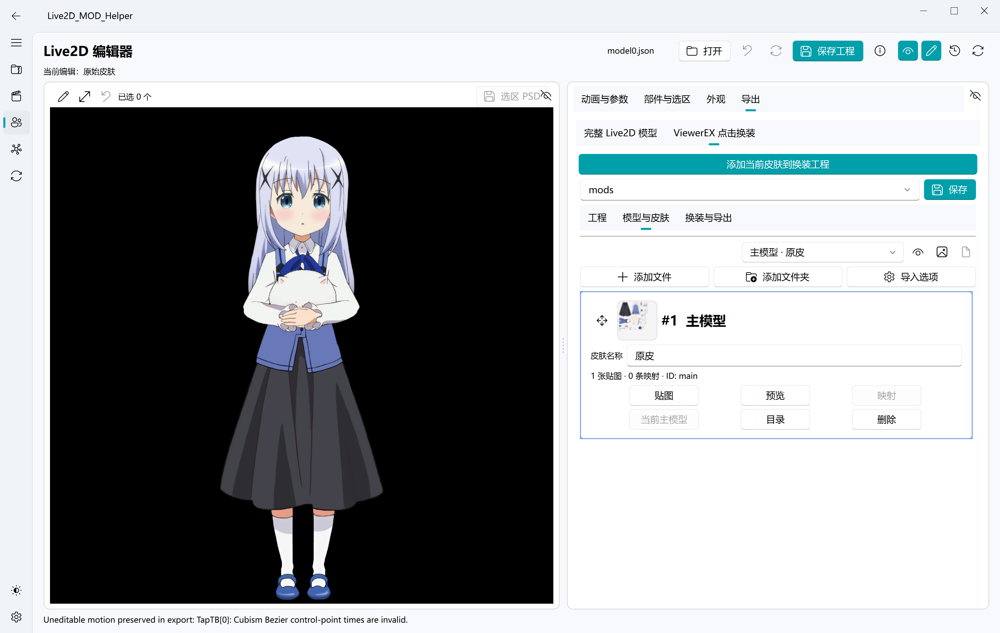

# Live2DViewerEX 换装工程


MOD 工程位于 Live2D 编辑器“导出 → ViewerEX 点击换装”，是 Live2DViewerEX 专用的高级流程：按工程主模型与贴图映射生成多个版本，并绑定 ArtMesh/HitArea 作为点击换装入口。普通皮肤管理与单皮肤完整模型导出无需创建此工程。高级工程使用 `project.live2dviewer_mod.json` 保存，不修改原始来源。

Live2DViewerEX 换装导出工作流：



编辑器中的 MOD 子工程位于根工程的 `mods/`，随根 `model.json` 一起保存和重开。旧版单独 MOD 工程的默认位置为：

```text
runtime/output/live2dviewer_mod/<工程名>/
```

### 1. 创建或载入工程

支持两种开始方式：

- 先新建并命名空工程，再导入主模型。
- 没有打开工程时直接拖入 Live2D 来源，由程序解析模型并自动创建工程。

从通用皮肤区使用当前编辑时，先“添加当前皮肤”，再在“模型与皮肤”将新快照设为主模型或拖到首位。换主会重新推断映射，须重新检查所有贴图映射和未占用触发部位后导出，手工映射不会保证原样保留。高级工程按主卡片的动作生成，不会自动覆盖用户指定的主模型或事件配置。

编辑器的工程搜索框列出当前 `mods/` 中的工程以及旧版工程记录，可切换已导入的工程。打开外部 `project.live2dviewer_mod.json` 会将它及其依赖导入当前根工程的独立副本，原工程不被改写。

工程支持新建、搜索/读取、重命名、保存、打开目录和删除。删除时默认只移除应用记录并保留磁盘文件，也可以明确选择永久删除整个工程文件夹。

### 2. 导入和管理皮肤

- 可拖入 LPK/WPK、`model3.json`、`.moc3`、Unity 资源、贴图或模型文件夹。
- 空工程第一次导入必须是完整 Live2D 模型，后续可以继续添加完整模型或仅有贴图差异的来源。
- 第一张卡片始终是主模型。
- 每个模型都可以命名为“原皮”“改图 1”等独立皮肤名称。
- 所有卡片都可以自由拖动排序；拖到顶部或点击“设为主模型”即可更换主模型。
- 支持一个模型使用多张贴图，并可以检查或手动调整贴图映射。
- 贴图查看器会显示分辨率、格式、文件大小、SHA-256 摘要，以及完全重复或同尺寸图片提示。
- 可以预览模型、查看贴图、打开来源目录或直接删除某个模型。

### 3. 设置换装 ArtMesh

从主模型中搜索并选择一个尚未绑定其他事件的 ArtMesh/HitArea。导出时程序会：

- 绑定换装菜单和 `change_model` 指令。
- 将该区域提升为最高点击优先级。
- 允许不可见 ArtMesh 接收点击。
- 避免把一个区域同时绑定到原有动作和换装事件。

如果主模型没有声明 HitAreas，程序会继续尝试读取模型中的 ArtMesh ID。更换主模型后，需要重新确认所选区域在新主模型中仍然存在且未被占用。

### 4. 导出创意工坊文件夹

选择“导出文件夹”后，程序会生成 Live2DViewerEX 可读取的模型切换结构、贴图和 JSON 映射表：

```text
MyMod/
├─ model0.json
├─ model1.json
├─ model2.json
├─ 1_0.png
├─ 1_1.png
├─ 2_0.png
├─ skin_manifest.json
└─ texture_mapping.json
```

`model0.json` 是主模型，其他 `modelN.json` 对应皮肤顺序。输出是普通文件夹而不是 ZIP，可以继续补充创意工坊所需内容后上传。

